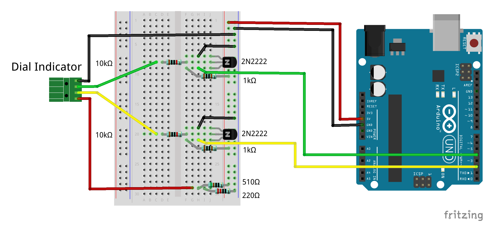
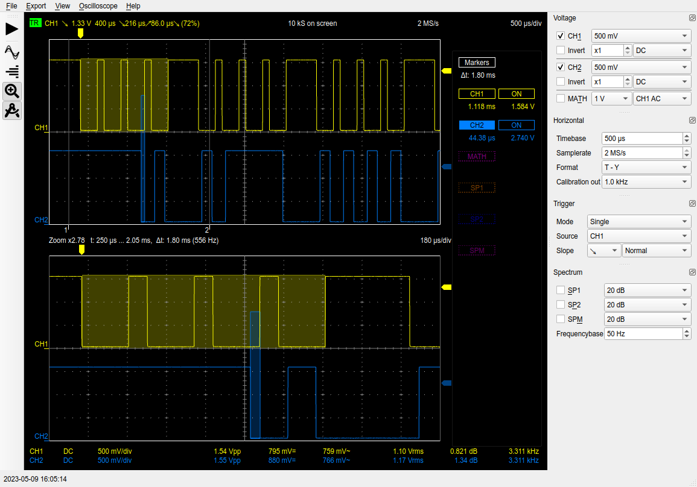
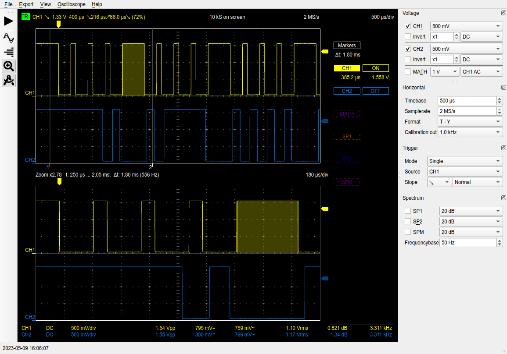
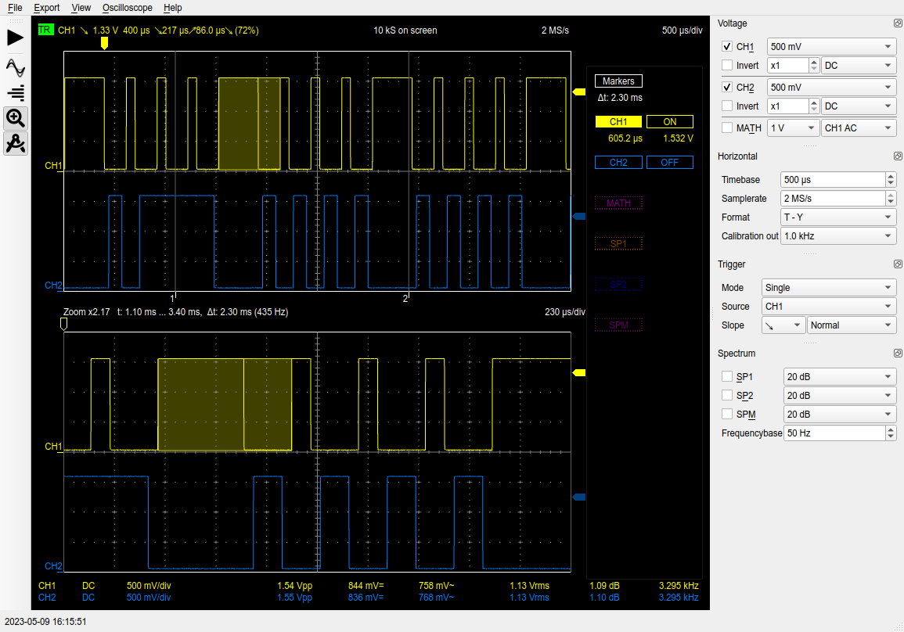
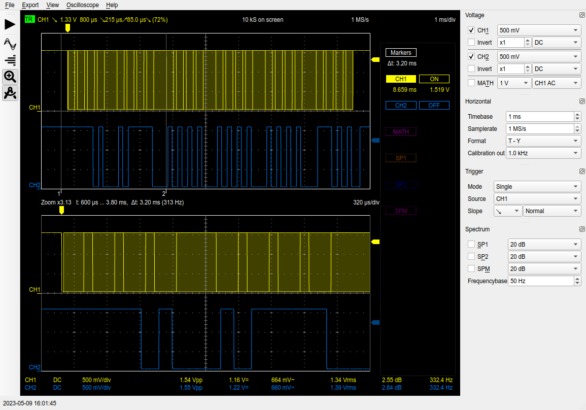
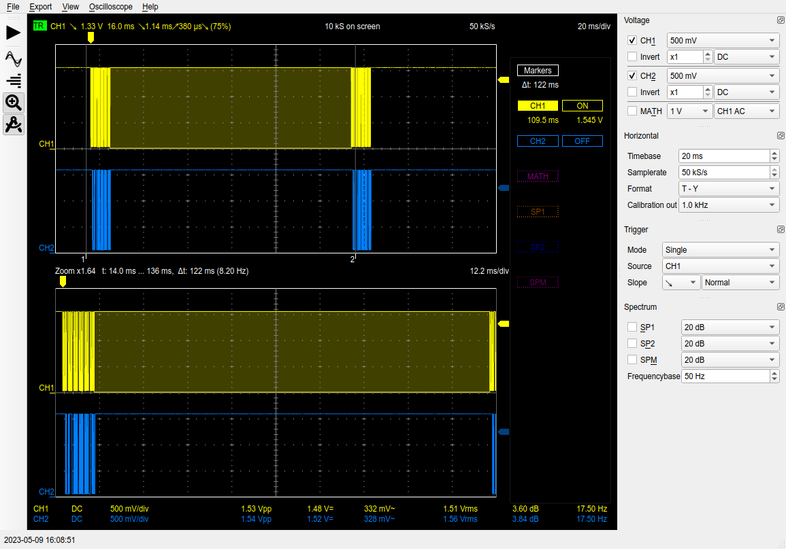
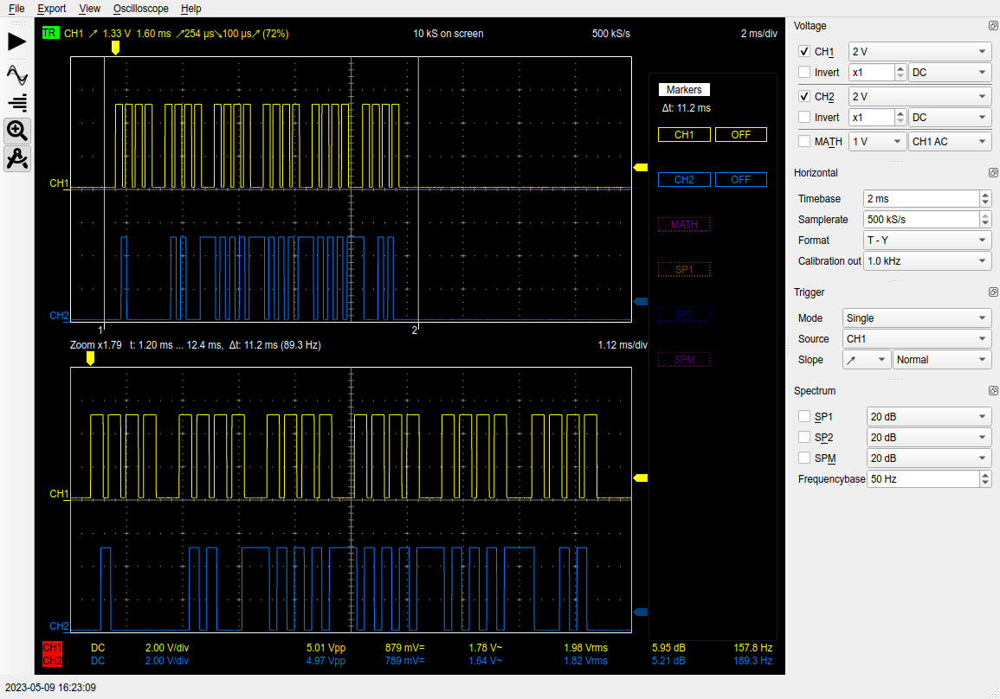

# Arduino Digital Dial Indicator/Caliper Reader

This code was developed to read values from a import (Chinese) digital
dial indicator. However, the same protocol is used for digital
calipers, tire gauges, micrometers, ...  Generically, these all are
referred to as a measuring device.

# TL;DR

## Parts list
* 1 Measuring Device (Dial Indicator, Digital Calipers, Tire Gauge, ...)
* 1 Arduino UNO (or equivalent)
* 1 Breadboard
* 2 Inverting Level Shifters (for clock and data)
  * 2 2N2222 NPN BJT Transistors (or equivalent)
  * 2 10kΩ Resistors
  * 2 1kΩ Resistors
* 1 Voltage Divider
  * 1 510Ω Resistor
  * 1 220Ω Resistor
* Connecting Wires

## Setup
1. Voltage Divider
   * Place the 510Ω resistor between +5V and a column on the breadboard
   * Place the 220Ω resistor between Ground and the same column on the
     breadboard
   * This column, where the two resistors meet, has the right voltage for
     the measuring device
1. Prepare Inverting Level Shifters (two times)
   * Identify the emitter, collector, and base of the BJT transistors
     from the coresponding datasheet.
   * Place a transistor in three columns of the breadboard
   * Connect the emitter to ground with a jumper wire
   * Connect the collect to +5V with a 1kΩ resistor
   * Connect the 10kΩ resistor from the base to the other side of the
     breadboard on the same column
   * Repeat for the second Inverting Level Shifter
1. Connect the Measuring Device
   * Connect a wire from the device ground to the breadboard ground
   * Connect a wire from the device 1.5V to the output of the voltage
     divider
   * Connect the device clock output to the same column as the 10kΩ resistor
     (other end of the resistor connecting to the base of the transistor)
   * Connect the device data output to the same column as the 10kΩ resistor
     on the second transistor
1. Arduino UNO Connections
   * Connect Arduino 5V to breadboard 5V
   * Connect Arduino ground to the breadboard ground
   * Connect Arduino PIN 2 (INT0) to the collector of the transistor
     with the clock line
   * Connect Arduino PIN 4 to the collector of the transistor
     with the data line

## Running

When running, enable the Arduino serial monitor. The values of the
measuring device will be sent over the serial port whenever the value
changes.

# Measurement Protocol

The measuring devices have a four pin port used for the protocol. From
left to right, looking at the port, the pads are: **1.5V**, **Clock**,
**Data**, **Ground**.

The data is transferred in 24-bit data packet (20 bits of data and 4
bits of metadata). Each data packet consists of *4 bit* nibbles. There
is a small time gap between nibbles and a much larger time gap between
data packets. The data values are valid on the trailing edge of the
clock pulse. The data arrives **least significant bit first** and metadata
nibble last.


If the unit is mm (unit bit not set), then the measurement value needs
to be divided by 100 to get the proper floating point value.  If the
unit is in inches (unit bit set), then the measurement values needs to
be divided by 2000 to get the correct floating point value. For
negative values, the sign bit will be set.

# Algorithm

Investigating the data from the device with a USB
[oscilloscope](#oscilloscope-tests), I determined the important
timings are 605 µs (the maximum time between two bits during the
24-bit data packet) and 110 ms (the time between 24-bit data packets). I
also saw that the data signal is available during the trailing edge of
the clock pulse.

In order to read the data during the trailing edge of the clock pulse,
I set up an external interrupt on pin 2 (INT0) of the Arduino.  The
interrupt is responsible for reading the data pin and storing the
value in a variable.

To know when the data is complete, all 24 bits read, it is not
sufficient to count the number of bits read as there is no guarantee
that data is from a single data packet. So a periodic interrupt is
needed to detect when the device is in the data packet gap. If a
periodic interrupt sees no data change in two sequential calls, then
it can assume it is in the gap as long as the period of the interrupt
is greater than 605 µs and less than half 110 ms. These boundaries
ensure that the interrupt will not run twice in the nibble gap and
will run at least twice in the data packet gap.

From the [Time/Counter Table](#atmega328p-timercounter-frequencies)
below, choosing an 8-bit counter with 1024 prescaler would result in a
16.4 ms period of the overflow interrupt. I chose timer2,
`ISR(TIMER2_OVF_vect)`, since it would not affect `delay()`,
`millis()`, ... When the interrupt detects it is in the data packet gap
(no change in subsequent calls), then if it has a full 24 bits, it
will move the data to another variable and set a `data_ready` boolean
for the `loop()` function to detect. If it doesn't have all 24 bits,
it means the data collection is out of sync, so it clears the data.

The `loop()` function just tests this boolean until it sees it has
something to do. If the data has changed since last iteration, it will
recalculate the human readable values and output it to the Serial
monitor.

# Breadboard Layout

<!--  -->


# Circuit Schematic

This schematic includes the voltage divider used to provide power
to the measuring device as well as the level shifter-inverting
circuits created with the two NPN (2N2222) BJT transistors.


# Oscilloscope Tests

Here are some screenshots from a USB oscilloscope showing the clock
and data pulses along with their timings.

## One Nibble Running on a LR44 (1.5V) Battery: 1.12 ms



## Gap Between Data Nibbles (1.5V): 385 µs



## Max Bit Change Time During Data Packet (1.5V): 605 µs



## Full 24-Bit Data Packet Time (1.5V): 8.66 ms



## Gap Between Data Packets (1.5V): 110 ms


## Full 24-Bit Inverted Data Packet (5V): -0.99 mm


## Full 24-Bit Inverted Data Packet (5V): -0.039 in



# AtMega328p Timer/Counter Frequencies

```
Timer/Counter frequency and timing with prescaler factors:
    F_CPU = 16 MHz (62.5 ns):
Prescaler    Freq.    Period     Fovf. 8    Period   Fovf. 16    Period 
     1       16 MHz   62.5 ns   62.5 kHz     16 µs     244 Hz    4.1 ms
     8        2 MHz    500 ns   7.81 kHz    128 µs    30.5 Hz   32.8 ms
    32*     500 kHz      2 µs   1.95 kHz    512 µs
    64!     250 kHz      4 µs     977 Hz   1.02 ms    3.81 Hz    262 ms
   128*     125 kHz      8 µs     488 Hz   2.05 ms
   256     62.5 kHz     16 µs     244 Hz    4.1 ms    954 mHz    1.05 s
  1024     15.6 kHz     64 µs      61 Hz   16.4 ms    238 mHz    4.19 s

Phase Correct PWM frequencies and timing with prescaler factors:
    F_CPU = 16 MHz (62.5 ns):
Prescaler    Freq.    Period     Fovf. 8    Period   Fovf. 16    Period 
     1       16 MHz   62.5 ns   31.4 kHz   31.9 µs     122 Hz   8.19 ms
     8        2 MHz    500 ns   3.92 kHz    255 µs    15.3 Hz   65.5 ms
    32*     500 kHz      2 µs     980 Hz   1.02 ms
    64!     250 kHz      4 µs     490 Hz   2.04 ms    1.91 Hz    524 ms
   128*     125 kHz      8 µs     245 Hz   4.08 ms
   256     62.5 kHz     16 µs     123 Hz   8.16 ms    477 mHz     2.1 s
  1024     15.6 kHz     64 µs    30.6 Hz   32.6 ms    119 mHz    8.39 s

Fast-PWM Compare Match Register Values for Duty Cycles:
Duty Cycle  Comp-8   ^Comp-8     Comp-16  ^Comp-16 
   0.0%          0       255          0     65535
  10.0%         25       230       6553     58982
  25.0%         63       192      16383     49152
  50.0%        127       128      32767     32768
  75.0%        191        64      49151     16384
  90.0%        229        26      58981      6554
 100.0%        255         0      65535         0

 *: Only available on Timer2
 !: Default prescaler set by Arduino IDE on Timer0 for delay(), millis()...
```
